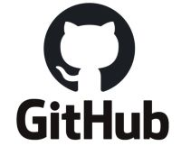
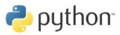
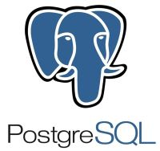
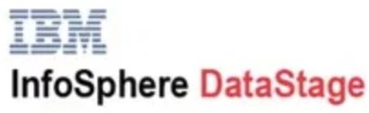
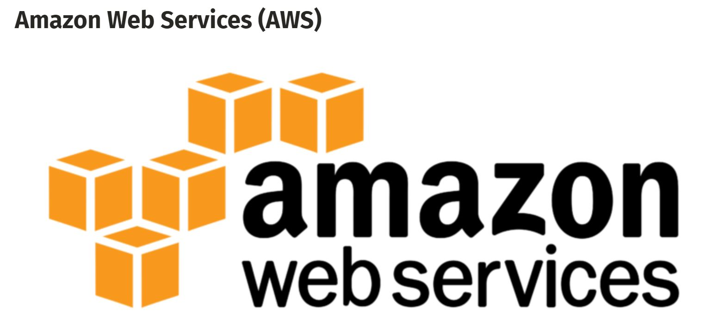

# [RoboCon 2020 Workshops](https://robocon.io/#workshops): [TEST AUTOMATION FOR THE ENTERPRISE DATA WAREHOUSE OR TEACHING AN OLD DOG NEW TRICKS!](https://robocon.io/#test-automation-for-the-enterprise-data-warehouse-or-teaching-an-old-dog-new-tricks!)
## Robby the Robot is ready for RoboCon2020 - are you?

# Table of Contents
1. [Introduction](#1-introduction)\
   1.1 [Abstract](#11-abstract)\
   1.2 [Presenter Bio](#12-presenter-bio)\
   1.3 [Robot Framework](#13-robot-framework)\
   1.4 [Robot Framework Database Library](#14-robot-framework-database-library) 
2. [Preparation](#2-preparation)\
   2.1 [Clone GitHub repository for this workshop](#21-clone-github-repository-for-this-workshop)\
   2.2 [Installation of Python and pip](#22-installation-of-python-and-pip)\
   2.3 [Installation of Robot Framework](#23-installation-of-robot-framework)\
   2.4 [Installation of Robot Framework Database Library](#24-installation-of-robot-framework-database-library)
3. [Python Database API Specification v2.0](#3-python-database-api-specification-v20)\
   3.1 [PEP-249](#31-pep-249)\
   3.2 [A brief introduction to DB-API2](#32-a-brief-introduction-to-db-api2)
4. [Robot Framework Database Library (External)](#4-robot-framework-database-library-external)\
   4.1 [GitHub Repository](#41-github-repository)\
   4.2 [API Documentation](#42-api-documentation)\
   4.3 [List of Interfaces](#43-list-of-interfaces)\
   4.4 [Review Robot Framework test suites located in test folder](#44-review-robot-framework-test-suites-located-in-test-folder)\
   4.5 [Why SQLite?](#45-why-sqlite)\
   4.6 [DB-API 2.0 for SQLite](#46-db-api-20-for-sqlite)\
   4.7 [Work through our first robot test suite](#47-work-through-our-first-robot-test-suite)
5. [Robot Framework Testing with PostgreSQL](#5-robot-framework-testing-with-postgresql)\
   5.1 [Preparation for PostgreSQL](#51-preparation-for-postgresql)\
   5.2 [Work through PostgreSQL robot test suite](#52-work-through-postgresql-robot-test-suite)
6. [Teradata Database Library (in-house development @ OP)](#6-teradata-database-library-in-house-development--op)\
   6.1 [Additional keywords we have added at OP](#61-additional-keywords-we-have-added-at-op)\
   6.2 [Review Teradata Support added to Database Library](#62-review-teradata-support-added-to-database-library)\
   6.3 [Discuss the different methods of extending keywords](#63-discuss-the-different-methods-of-extending-keywords)\
   6.4 [Different types of testing](#64-different-types-of-testing)
7. [Test Automation with Jenkins CI](#7-test-automation-with-jenkins-ci)\
   7.1 [Continuous Integration 101](#71-continuous-integration-101)\
   7.2 [Jenkins CI](#72-jenkins-ci)\
   7.3 [Introducing EDW Test Runner](#73-introducing-edw-test-runner)
8. [IBM InfoSphere® DataStage Library (in-house development @ OP)](#8-ibm-infosphere-datastage-library-in-house-development--op)\
   8.1 [IBM InfoSphere® DataStage](#81-ibm-infosphere-datastage)\
   8.2 [Robotic Process Automation (RPA)](#82-robotic-process-automation-rpa)\
   8.3 [Smart Data Loader](#83-smart-data-loader)
9. [The future - what are we working on next @ OP?](#9-the-future---what-are-we-working-on-next--op)\
   9.1 [Fully Automated Unit/Smoke Testing](#91-fully-automated-unitfunctional-testing)\
   9.2 [Jira & ServiceNow RPA Libraries](#92-jira--servicenow-rpa-libraries)\
   9.3 [Cloud Computing Workflow](#93-cloud-computing-workflow)\
   9.4 [Control-M Workload Automation](#94-control-m-workload-automation)\
   9.5 [Kibana Dashboard Integration](#95-kibana-dashboard-integration)\
   9.6 [Integrating Machine Learning and Data Science](#96-integrating-machine-learning-and-data-science)

## 1. Introduction
### 1.1 Abstract
The concept of data warehousing dates back to the late 1980s so you would be forgiven for thinking that test automation
has little to offer this domain. OP needed to find a way of improving the quality of DW solutions: enter Robot Framework.
You really can teach an old dog new tricks!
### 1.2 Presenter Bio
* Adrian Yorke is a Senior Data Specialist and DevOps Engineer at OP, one of Finland's largest and oldest Financial groups.
* Driving force behind the adoption of DevOps and Test Automation using Robot Framework in the Data Warehousing tribe.
* During 2019 authored and presented a Python Summer Camp workshop series.
* Tech interests: Python, Raspberry Pi & Open Source projects. Recently I've been studying machine learning and data science.
* When I'm not being a geek: swimming (former British national championship swimmer), long distance running (I actually completed
the London marathon!), carpentry & just being there for my daughter and helping her grow.
### 1.3 Robot Framework
\
Introductory paragraph from robotframework.org:

> “[Robot Framework](http://robotframework.org/) is a generic open source automation framework for acceptance testing,
> acceptance test driven development (ATDD), and robotic process automation (RPA). It has easy-to-use tabular test data syntax
> and it utilizes the keyword-driven testing approach. Its testing capabilities can be extended by test libraries implemented
> either with Python or Java, and users can create new higher-level keywords from existing ones using the same syntax that
> is used for creating test cases.”

[Robot Framework User Guide](http://robotframework.org/robotframework/latest/RobotFrameworkUserGuide.html)
contains all you need to get started and it also covers more advanced topics such as development of your own test libraries.

### 1.4 Robot Framework Database Library
Database Library contains utilities (keywords) meant for Robot Framework's usage. This can allow you to query your
database after an action has been made to verify the results.

## 2. Preparation
### 2.1 Clone GitHub repository for this workshop

#### For those that wish to follow along, clone the GitHub repository which contains workshop documentation and examples:
> `$ git clone https://github.com/adrianyorke/forbiddenplanet`
### 2.2 Installation of Python and pip

#### Python 2 vs Python 3
Which version of Python should I use?  Check the [wiki](https://wiki.python.org/moin/Python2orPython3) from python.org.
Quite simply, you should be using Python 3 going forward.  Any existing Python 2 code should be converted to Python 3 as
soon as possible which might take some time for large projects.
Python 2 is becoming "End of Life" and the final release will be April 2020. After that date Python 2 will receive no
further official support and you should expect the community to gradually drop support for Python 2.
#### Check which versions of Python and pip (The Python Package Installer) are installed:
> `$ python3 --version`\
> `$ pip3 --version`
#### If required, install pip (The Python Package Installer):

pip is a tool for installing packages from the [Python Package Index](https://pypi.org/) (also know as The Cheeseshop).
If your organization has blocked access to pypi.org, your company will probably be using an internally-managed, package
index, e.g. [Artifactory](https://jfrog.com/artifactory/).

> In most cases, you should use pip within a virtual environment only. Python virtual environments allow you to install
> Python modules in an isolated location for a specific project, rather than being installed globally.
> This way you do not have to worry about affecting other Python projects.

Virtual environments are beyond the scope of this workshop, however, they are not difficult to create or use and they are
recommended for any non-trivial development.  More information can be found in
[The Python Tutorial](https://docs.python.org/3/tutorial/venv.html) documentation.

#### Installing pip:
> `$ sudo apt update`\
> `$ sudo apt install python3-pip`
### 2.3 Installation of Robot Framework
\
Installation of Robot Framework is documented [here](https://github.com/robotframework/robotframework#installation).
There are two main methods of installation: using pip or installing the latest version from source code from PyPi or GitHub.
#### Install using pip:
> `$ pip3 install robotframework`\
> `$ python3 -m robot --version`
#### For the latest development branch, install by cloning the repository from GitHub and run setup.py:
> `$ git clone https://github.com/robotframework/robotframework.git`\
> `$ cd robotframework`\
> `$ python3 setup.py install`
### 2.4 Installation of Robot Framework Database Library
#### Install using pip:
> `$ pip3 install robotframework-databaselibrary`

## 3. Python Database API Specification v2.0
### 3.1 PEP 249
PEPs (Python Enhancement Proposals) are the mechanism for defining and discussing new Python language features.
[PEP 249](https://www.python.org/dev/peps/pep-0249/) introduces Python Database API Specification v2.0.
It is important to remember that [PEP 249](https://www.python.org/dev/peps/pep-0249/) is only a specification and does
not define the technical implementation.
### 3.2 A brief introduction to DB-API2
Introductory paragraph from [PEP 249](https://www.python.org/dev/peps/pep-0249/) which defines Database API Specification v2.0:

> “This API has been defined to encourage similarity between the Python modules that are used to access databases. By doing
> this, we hope to achieve a consistency leading to more easily understood modules, code that is generally more portable
> across databases, and a broader reach of database connectivity from Python.”

[A brief introduction to DB-API2](https://cewing.github.io/training.codefellows/lectures/day21/intro_to_dbapi2.html)

## 4. Robot Framework Database Library (External)
Database Library is a [Robot Framework Test Library](https://robotframework.org/#libraries) classed as non-standard or
external library. It was originally designed and implemented by [Franz Allan Valencia See](https://github.com/franz-see)
and is currently maintained by [Jerry Schneider](https://github.com/jerry57).
### 4.1 GitHub Repository
The [Robotframework-Database-Library](https://github.com/franz-see/Robotframework-Database-Library) GitHub repository
contains code and sample test scripts.

In order to run the Database Library test suites locally it is necessary to clone the repository from GitHub:
> `$ git clone https://github.com/franz-see/Robotframework-Database-Library.git`

### 4.2 API Documentation
The [API Documentation](https://franz-see.github.io/Robotframework-Database-Library/api/0.5/DatabaseLibrary.html) lists
the keywords available in Robot Framework for interactions with databases.
### 4.3 List of Interfaces
[List of Interfaces](https://wiki.python.org/moin/DatabaseInterfaces) documents the database interfaces that have already
been implemented.  If your database is not listed you many need to create your own Robot Framework library to implement
Robot Framework keywords for testing or RPA scripts.  If it is necessary to create your own library, please do consider
sharing with the open source community by submitting a pull request.
### 4.4 Review Robot Framework test suites located in test folder
Let's have a look at the [test](https://github.com/franz-see/Robotframework-Database-Library/tree/master/test) folder and
explore some of the test suites available. 
### 4.5 Why SQLite?
\
SQLite is a fully featured database that ships by default with the Python Standard Library and is implemented using C.
There is no server installation or configuration and the whole relational database is implemented using only a single file.
Despite this simplicity of design, SQLite is surprising feature rich and provides an excellent way of learning about
database and SQL. To understand appropriate uses for SQLite I recommend reviewing the comprehensive
[summary](https://www.sqlite.org/whentouse.html) at sqlite.org.

Opening statements from the sqlite.org summary:

> “SQLite is not directly comparable to client/server SQL database engines such as MySQL, Oracle, PostgreSQL, or SQL Server
> since SQLite is trying to solve a different problem.
>
> Client/server SQL database engines strive to implement a shared repository of enterprise data. They emphasize scalability,
> concurrency, centralization, and control. SQLite strives to provide local data storage for individual applications and
> devices. SQLite emphasizes economy, efficiency, reliability, independence, and simplicity.
>
> SQLite does not compete with client/server databases. SQLite competes with fopen().”

SQLite is available on all Python installations and one of the appropriate uses mentioned in the sqlite.org summary is
"Education and Training" so SQLite examples are a good place to begin our workshop training.

### 4.6 DB-API 2.0 for SQLite
[DB-API 2.0 interface for SQLite databases](https://docs.python.org/2/library/sqlite3.html)
### 4.7 Work through our first robot test suite
Work through [SQLite test suite](test/SQLite3_DB_Tests.robot)
and check our installation is working.

Summary of database library keywords which we will be covering in the
[SQLite test suite](test/SQLite3_DB_Tests.robot)
in the order that they are used:
* `Connect To Database Using Custom Params`
* `Execute SQL String`
* `Check If Exists In Database`
* `Check If Not Exists In Database`
* `Table Must Exist`
* `Row Count Is 0`
* `Row Count Is Equal To X`
* `Row Count Is Less Than X`
* `Row Count Is Greater Than X`
* `Row Count`
* `Description`
* `Query`
* `Delete All Rows From Table`

## 5. Robot Framework Testing with PostgreSQL
\
Introductory paragraph from [PostgreSQL.org](https://www.postgresql.org/):

> PostgreSQL is a powerful, open source object-relational database system
> with over 30 years of active development that has earned it a strong reputation for reliability,
> feature robustness, and performance. The World's Most Advanced Open Source Relational Database.

### 5.1 Preparation for PostgreSQL
* For PostgreSQL testing, we will use a PostgreSQL instance installed on Windows Subsystem for Linux (WSL).
You can use this [simple guide](https://medium.com/@harshityadav95/postgresql-in-windows-subsystem-for-linux-wsl-6dc751ac1ff3)
to install and configure PostgreSQL on Windows Subsystem for Linux (WSL).
Once the database is installed (and each time your restart the host) you will need start up the service in WSL:
> `$ sudo service postgresql start`
* Next you will need to install a database adapter to access PostgreSQL using Python and Robot Framework.
[Psycopg](https://pypi.org/project/psycopg2/) is the most popular
PostgreSQL database adapter for the Python programming language:
> `$ pip3 install psycopg2`
* Although not essential, it is also recommended that you install an administration tool if you plan to
do any serious development work with PostgreSQL.
I recommend the Open Source tool [pgAdmin](https://www.pgadmin.org/download/).
### 5.2 Work through PostgreSQL robot test suite
Work through [PostgreSQL test suite](test/PostgreSQL_DB_Tests.robot)
and check our installation is working.

> Note: there is a slight modification to the default test suite.  I moved `Drop person and foobar tables` test case
> to the beginning of the test suite so the data and tables persist between tests.

Summary of database library keywords which we will be covering in the
[PostgreSQL test suite](test/PostgreSQL_DB_Tests.robot)
in the order that they are used:
* `Connect To Database` (called by `Suite Setup` in `*** Settings ***`)
* `Execute SQL String`
* `Execute SQL Script`
* `Check If Exists In Database`
* `Check If Not Exists In Database`
* `Table Must Exist`
* `Row Count Is 0`
* `Row Count Is Equal To X`
* `Row Count Is Less Than X`
* `Row Count Is Greater Than X`
* `Row Count`
* `Description`
* `Query`
* `Delete All Rows From Table` (commented out using `*** Comments ***`)

## 6. Teradata Database Library (in-house development @ OP)
### 6.1 Additional keywords we have added at OP
When we first discovered [Robotframework-Database-Library](https://github.com/franz-see/Robotframework-Database-Library)
on GitHub there was no support for Teradata databases. We didn't have the skills to add Teradata support at the time so we created
our own internal Teradata Database Library.

Additional keywords were created to enhance the library for OP purposes:
* `Execute SQL From File` (including token replacement code)
* `Replace Table` (also drops stats and calls `Drop Table`)
* `Drop Table` (also drops stats)
* `Query Table` (simple SELECT * implementation - careful with large tables)
* `Table Contains Data` (alias for row count != 0)
* `Verify Column Count` (useful for checking versions)
* `View Must Exist` (similar to `Table Must Exist` but for database views)
* `Database Must Exist` (helps check deployment automation)
* `gcfrRegistrationMustExist` (checks Global Control Framework metadata)
### 6.2 Review Teradata Support added to Database Library
In October 2019, we raised [Issue #122](https://github.com/franz-see/Robotframework-Database-Library/issues/122)
to add support for Teradata 15 & 16 to Robot Framework Database Library.

In November 2019, [Pull Request #124](https://github.com/franz-see/Robotframework-Database-Library/pull/124/) was created with the required additions to implement support for Teradata 15 & 16.
The following changes were merged during December:
* `.gitignore` (ignore `test/logs/` folder created by Teradata DevOps module)
* `src/DatabaseLibrary/assertion.py` (Teradata SQL implementation using DBC)
* `src/DatabaseLibrary/connection_manager.py` (Teradata specific port and connect method)
* `test/Teradata_DB_Tests.robot` (new test suite for Teradata)
### 6.3 Discuss the different methods of extending keywords
The simplest way to extend Robot Framework functionality is to [create user keywords](https://robotframework.org/robotframework/latest/RobotFrameworkUserGuide.html#creating-user-keywords):

> Keyword tables are used to create new higher-level keywords by combining existing keywords together.
> These keywords are called user keywords to differentiate them from lowest level library keywords that
> are implemented in test libraries. The syntax for creating user keywords is very close to the syntax for
> creating test cases, which makes it easy to learn.

User keywords can be created in test case files, resource files and test suite initialization files under
a `*** Keywords ***` section.

Another way of adding keywords is that you amend the Python library code.  This requires some developer skills
but it is quite straightforward.  Packaging and distributing libraries is a little more challenging and you need to
carefully consider what strategy use for deploying updates.  You will see many examples on GitHub if you search
for GitHub repositories beginnning with "robotframework-".

### 6.4 Different types of testing
Martin Fowler summarised the different kinds of automated tests using what he calls the
[Test Pyramid](https://martinfowler.com/bliki/TestPyramid.html).  In the database domain, Service Tests are
broadly equivalent to Functional Tests.  UI tests would best be implemented by tests against what is known
in Teradata world as the Access Layer (often abbreviated as AXS).

**Unit/Smoke Testing**\
Unit testing or smoke testing is the most basic form of testing.  It is also the type testing that is generally the
easiest to define.  Unit tests are typically small, simple and fast executing.  They are often used to perform
technical quality assurance during the deployment process, or simple sanity checks for the developer.

**Functional Testing**\
Functional testing in the database domain normally involves performing more detailed analysis.  For example,
functional tests might analyse the Primary Key or Unique Index.  They can also identify orphaned Foreign Keys when
there is no technical restriction implemented by the relational database.   In the database domain,
functional tests normally require data (or at least one row) to be loaded into the tables being tested as
it is not possible to perform functional testing on empty tables.

Addtional keywords were added to support functional testing at OP and distributed via a common resource file:
* `Verify Unique Index`
* `Verify Unique Rows CTL_ID End Date`
* `Verify Unique Rows CTL_ID`
* `Verify Unique Rows Different CTL_ID`
* `Verify Unique Rows CTL_ID End Date WITH WHERE`

**Regression Testing**\
It's important to check that each release does not break any existing features.
In the database domain, regression testing will normally require a separate database environment.

For each data source, it is necessary to define a standard set of data files that can be reloaded at any
time into a clean environment in order to perform regression testing.  It should also be possible to perform
a more complete regression test where files for many (or all) data sources are reloaded to check for any errors
that may have been introduced with the latest changes.

## 7. Test Automation with Jenkins CI
### 7.1 Continuous Integration 101
Simple defintion from [ThoughtWorks](https://www.thoughtworks.com/continuous-integration):

> Continuous Integration (CI) is a development practice that requires developers to integrate code
> into a shared repository several times a day. Each check-in is then verified by an automated build
> [and automated tests], allowing teams to detect problems early.

A statement from [Atlassian](https://www.atlassian.com/continuous-delivery/continuous-integration)
about Continuous Integration:

> Continuous integration (CI) is the practice of automating the integration of code changes from multiple
> contributors into a single software project. The CI process is comprised of automatic tools that assert
> the new code’s correctness before integration. A source code version control system is the crux of the CI process.
> The version control system is also supplemented with other checks like automated code quality tests,
> syntax style review tools, and more. 

In the database domain, like many other domains, regular integrations of code is critical.
The code is most likely to consist of scripts, database configuration, metadata, mappings & transformations,
ETL process defintions and scripts for scheduling.  In the past database code was
integrated too late, usually when the solution moved up to the next environment.  This can be many days
or weeks after the developer committed the code/scripts.

It is vital that developer pushes to the version control system are built and tested as soon as possible
and this is exactly the problem that Continuous Integration and Test Automation solves.

We run tests using Robot Framework which checks, for example, that internal standards have been followed in the code.
In the event of an error the information is fed back via email and MS Teams.
### 7.2 Jenkins CI
\
Opening statement from the [wiki](https://en.wikipedia.org/wiki/Jenkins_(software)):

> Jenkins is a free and open source automation server. Jenkins helps to automate the non-human
> part of the software development process, with continuous integration and facilitating technical aspects
> of continuous delivery.

To get started with Jenkins you need to download the software from the [download site](https://jenkins.io/download/)
for your OS. You can also use a pre-configured virtual machine, Docker container or a cheap, single board computer
like a [Raspberry Pi](https://raspberrytips.com/install-jenkins-raspberry-pi/) to run a local Jenkins
instance.

Detailed instructions for new installations of Jenkins on a single/local machine can be found in the [Jenkins
User Documentation](https://jenkins.io/doc/book/installing/).

You will need to use the [Jenkins Robot Framework Plugin](https://plugins.jenkins.io/robot)
### 7.3 Introducing EDW Test Runner
We needed a utility that would run Robot Framework test suites and Python xUnit test suites side-by-side.
When we initially set up Test Automation, we were not aware of Robot Framework so we created test suites using Python
code and the [unittest library](https://docs.python.org/3.8/library/unittest.html)

EDW Test Runner was created to simplify the process of both local manual test execution and running tests automatically
on the Continuous Integration server,  e.g. using Jenkins jobs.

EDW Test Runner also handles authentication, environment switching, token replacement and log merging.

Summary of the main command line arguments to give you some idea of the full functionality:
* `--test_files` (test suite filter, e.g. "*.robot" or "*.py")
* `--included_tags` (include specific tags, e.g. "smoke" to include smoke tests only)
* `--excluded_tags` (exclude specific tags, e.g. "dataloaded" to exclude tests that require data to be loaded)
* `--save_to_db` (save output to Teradata database)
* `--verbose` (additional logging information)
* `--timeout` (defaults to 600 seconds)
* `--environment` (Dev, Integration, Test, PreProd, Prod, etc.)

## 8. IBM InfoSphere® DataStage Library (in-house development @ OP)
### 8.1 IBM InfoSphere® DataStage
\
Brief description of [IBM InfoSphere® DataStage](https://www.ibm.com/products/infosphere-datastage):

> Extract, transfer and load (ETL) data for enterprise applications in multicloud or hybrid environments,
> supporting extended metadata management and big-data connectivity
### 8.2 Robotic Process Automation (RPA)
Robotframework.org introduces [RPA](https://robotframework.org/rpa/):

> Robot Framework is an open source robotic process automation (RPA) solution that is used
> to automate business processes. It is open and extensible which means that it can be integrated with
> virtually any other tool to create powerful and flexible RPA solutions.

In its simplest form, you can consider RPA as being similar to batch scripting.  However, using Robot Framework
it is possible to implement more complex end-to-end testing across multiple Systems Under Test (SUTs),
multiple technology stacks and architectures.  In the Smart Data Loader example next you will see how we use RPA to make
intelligent processing decisions based on Teradata Database state, DataStage state and File System state.
### 8.3 Smart Data Loader
We needed a utility that could be used to load data more intelligently than simply running dumb shell scripts.  Shell scripts
are fine for simple cases, where everything is perfect but that is rare.  If we are loading 1000 files at the 
weekend or overnight when no human is monitoring, we did not want the data loading process to fail if the network
was briefly unavailable.

The basic building blocks for Smart Data Loader include:
* Teradata Database Lib (Robot Framework library already developed internally)
* DataStage Lib (DataStage Robot Framework library developed internally)
* File System Lib (basic keywords already available via [OperatingSystem](http://robotframework.org/robotframework/latest/libraries/OperatingSystem.html) Standard library)

In order to load data automatically (and in a smart manner) into the data warehouse we required a number of additional
keywords to automate state checks and state transitions in the database as the load process progresses.  These
higher-level keywords were implemented using a resource file built on top of Teradata Database Library:
* `Reset Business Date`
* `Reset Stream`
* `Reset Process State`
* `Set Stream State`
* `Set Business Date State`
* `Validate BusinessDate State`
* `Validate Stream State`
* `No Open Processes For Stream`
* `Stream Is Closed`
* `Business Date Is Closed`
* `Verify Process Has Run`
* `Verify Process State`

As well as Teradata database RPA, it is of course necessary to drive the actual ETL (Extract Transform Load) process jobs
using DataStage.  The following additional higher-level keywords were implemented using DataStage Library:
* `Reset And Run Job`
* `Reset And Run Job With Parameters`
    
The underlying Robot Framework DataStage Library is a simple class library using the `subprocess`
Python standard library to interact with the operating system.

IBM provides a number of command line
utilities that we can use to implement a Robot Framework library to interact with DataStage:
* [dsadmin](https://www.ibm.com/support/knowledgecenter/en/SSZJPZ_9.1.0/com.ibm.swg.im.iis.ds.cliapi.ref.doc/topics/r_dsvjbref_Commands_for_Administering_WebSphere_DataStage.html)\
There is a single command for administering projects, dsadmin. The command has a large range of options.
* [dsjob](https://www.ibm.com/support/knowledgecenter/SSZJPZ_11.7.0/com.ibm.swg.im.iis.ds.direct.doc/topics/t_ddesref_running_job_command_line.html)
You can run the dsjob command to start jobs, stop jobs, set an alias for jobs, and access other functions.
* [istool](https://www.ibm.com/support/knowledgecenter/SSZJPZ_11.7.0/com.ibm.swg.im.iis.iisinfsv.assetint.doc/topics/commandset.html)\
You can use the istool commands to manage assets that are stored in the metadata repository of
InfoSphere® Information Server.

## 9. The future - what are we working on next @ OP?
### 9.1 Fully Automated Unit/Functional Testing
During the past 2 years, developers have been manually creating Robot Framework unit test suites for each solution they
deploy to production.  The testing team have been manually creating additional functional test suites for each solution.
These test suites are committed to Subversion so Jenkins can acquire and execute the tests automatically.

Looking at the unit test suites, it is quite reasonable to state that the tests could be automatically generated based
on information we already have for the solution contained within the deployment package and Teradata database catalog tables (DBC).
We have already created a Proof of Concept Python solution that automatically creates a unit test suite.  Furthermore, it's
possible to include many more detailed tests that the human writer would not have time to perform.  For example, precise
column definitions of which there can be many 100s.

When we consider Functional Testing, many of the tests are checking things like Primary Index violations and Foreign Key
matches.  Again, using the information we already have in our mappings data we can automatically generate suitable
functional tests using existing keywords.

In summary, we already have the information we need to fully automate the creation of unit test and function test suites
and this is something we will be focussing on during 2020.

### 9.2 Jira & ServiceNow RPA Libraries
[Jira](https://www.atlassian.com/software/jira) & [ServiceNow](https://www.servicenow.com/) are popular platforms for
implementing digital workflows across the enterprise.

Both services offer RESTful JSON APIs as a way of automating
ticketing  workflows, especially creating and updating issues in response to events that occur in the
continuous delivery pipeline, for example.

Robot Framework already offers the [RESTinstance Library](https://github.com/asyrjasalo/RESTinstance) which could be
used as a base for higher level user keywords.

> RESTinstance relies on Robot Framework's language-agnostic, clean and minimal syntax, for API tests. It is neither tied to
> any particular programming language nor development framework. Using RESTinstance requires little, if any, programming
> knowledge. It builts on long-term technologies with well established communities, such as HTTP, JSON (Schema),
> Swagger/OpenAPI and Robot Framework.

Alternatively, it would be relatively straightforward to implement Jira and ServiceNow specific Robot Framework libraries.
We already have base Python classes that have implemented some of the standard workflows so it would be simple to port
these across to new Robot Framework libraries that could be used by a wider audience.
### 9.3 Cloud Computing Workflow

OP uses [Amazon Web Services (AWS)](https://aws.amazon.com/what-is-aws/) as our Cloud Computing platform.  

> Amazon Web Services (AWS) is the world’s most comprehensive and broadly adopted cloud platform, offering over 175
> fully featured services from data centers globally.

In this section we focus on AWS although the same Robot Framework integrations, workflows and techniques decribed here
could be implemented with all major cloud vendors.

During 2019 it became apparent that we were lacking a common Test Automation framework for our cloud-hosted data solutions.
The on-premise data warehouses were actively using Robot Framework to test data files and databases so we started
to explore options using Robot Framework and [Robot Framework AWS Library](https://github.com/teaglebuilt/robotframework-aws)

Unfortunately, there were a number of issues with Robot Framework AWS Library, not least that the licencing model was
quite restrictive for company use so we were unable to immediately import the library.  Once we made contact with the
author, it was clear that there had been a mistake.  This also explained the limited/slow uptake of the AWS library.
The author change the license from `GNU Affero General Public License v3.0` to the more liberal and commonly used
`MIT License (MIT)`

We have helped the author by logging issues, creating pull requests and generally helping develop the library further.
Recently, we were able to implement a Robot Framework solution that interacts with Amazon S3, checking file format
and contents and comparing with the control file.
### 9.4 Control-M Workload Automation

[Control-M](https://www.bmc.com/it-solutions/control-m.html) is used by major companies to manage enterprise-wide
workloads and workflow orchestration across all major platforms, including Unix/Linux, Windows and mainframe.

> Control-M simplifies application workflow orchestration. It makes it easy to define, schedule, manage and monitor
> workflows, ensuring visibility and reliability, and improving SLAs.

In recent years, Control-M has undergone a major revamp. BMC have rebuit the service from the ground up and now offer
what they call [Jobs-as-Code](http://jobsascode.io/).  Cross-platform, workflow jobs are defined using developer-friendly
JSON and the service can be orchestrated via RPA using the REST API interface which is offered as standard.

It is also possible to trigger build and deploy processes via the REST API interface which allows Control-M
configurations to be defined, built, tested and deployed using contemporary DevOps CI/CD pipelines.
### 9.5 Kibana Dashboard Integration
\
Introductory paragraph from the [Kibana wiki](https://en.wikipedia.org/wiki/Kibana):

> “Kibana is an open source data visualization dashboard for Elasticsearch. It provides visualization capabilities on top
> of the content indexed on an Elasticsearch cluster. Users can create bar, line and scatter plots, or pie charts and maps
> on top of large volumes of data.”

When we automate tests using the Jenkins Integration Test instance at OP, the Robot Framework logs are automatically
exported to Elasticsearch.  Kibana sits on  top of Elasticsearch so we have extensive possiblities to visualize
the status of test automation.

### 9.6 Integrating Machine Learning and Data Science
The QA & Testing domain is quite prescriptive.  We define 100s of 1000s  of tests and rely on humans to decide which tests
would be most relevant in a given scenario.  The humans use their past observations, general experience and feed that back
in to make decisions about which tests to run.  This challenge is highly suited to machine learning.

Contemporary Continuous Deployment pipelines require more intelligent, focused testing.  In the early days, it used to be
acceptable to simply rerun all tests for each change or release and look for any failures.  Now we deploy many times
per day so we need to focus our efforts in the right area rather than simply "blanket testing" each patch.
This is something Machine Learning could really help with.

Reminder of the [definition of Machine Learning](https://expertsystem.com/machine-learning-definition/):

> “Machine learning is an application of artificial intelligence (AI) that provides systems the ability to automatically
> learn and improve from experience without being explicitly programmed.”

Supervised Machine Learning is particularly relevant in the testing domain:

> “Supervised machine learning algorithms can apply what has been learned in the past to new data using labeled examples
> to predict future events.”

It makes sense to use Jupyter (& underlying IPython kernal) as an enabling framework for experimentation in the QA/Testing domain.
Data science and data analysis techniques especially when applied to historical Robot Framework logs are highly relevant
and the core DS packages, especially: pandas, numpy, scipi, scikit-learn.
Also matplotlib & seaborn for media quality, inline visualizations. 

Most data source are not clean, including Robot Framework logs.  This requires an iterative, experimentation approach when
developing suitable models.  Jupyter Notebooks are perfect for this and are my primary tool when developing more complex logic.
