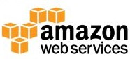
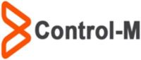

# [RoboCon 2020 Workshops](https://robocon.io/#workshops): [TEST AUTOMATION FOR THE ENTERPRISE DATA WAREHOUSE OR TEACHING AN OLD DOG NEW TRICKS!](https://robocon.io/#test-automation-for-the-enterprise-data-warehouse-or-teaching-an-old-dog-new-tricks!)
## Robby the Robot is ready for RoboCon2020 - are you?

# Table of Contents
1. [Introduction](#1-introduction)\
   1.1 [Abstract](#11-abstract)\
   1.2 [Presenter Bio](#12-presenter-bio)\
   1.3 [Robot Framework](#13-robot-framework)\
   1.4 [Robot Framework Database Library](#14-robot-framework-database-library) 
2. [Preparation](#2-preparation)\
   2.1 [Clone GitHub repository for this workshop](#21-clone-github-repository-for-this-workshop)\
   2.2 [Installation of Python and pip](#22-installation-of-python-and-pip)\
   2.3 [Installation of Robot Framework](#23-installation-of-robot-framework)\
   2.4 [Installation of Robot Framework Database Library](#24-installation-of-robot-framework-database-library)
3. [Python Database API Specification v2.0](#3-python-database-api-specification-v20)\
   3.1 [PEP-249](#31-pep-249)\
   3.2 [A brief introduction to DB-API2](#32-a-brief-introduction-to-db-api2)
4. [Robot Framework Database Library (External)](#4-robot-framework-database-library-external)\
   4.1 [GitHub Repository](#41-github-repository)\
   4.2 [API Documentation](#42-api-documentation)\
   4.3 [List of Interfaces](#43-list-of-interfaces)\
   4.4 [Review the Robot Framework test suites located in test folder](#44-review-the-robot-framework-test-suites-located-in-test-folder)\
   4.5 [Why SQLite?](#45-why-sqlite)\
   4.6 [DB-API 2.0 for SQLite](#46-db-api-20-for-sqlite)
   4.7 [Work through our first robot test suite](#47-work-through-our-first-robot-test-suite)
5. [Robot Framework Testing with Teradata](#5-robot-framework-testing-with-teradata)\
6. [Teradata Database Library (in-house development @ OP)](#6-teradata-database-library-in-house-development--op)\
7. [Test Automation with Jenkins CI](#7-test-automation-with-jenkins-ci)\
8. [IBM InfoSphere DataStage Library (in-house development @ OP)](#8-ibm-infosphere-datastage-library-in-house-development--op)\
9. [The future - what are we working on next @ OP?](#9-the-future---what-are-we-working-on-next--op)\
   9.1 [Fully Automated Unit/Smoke Testing](#91-fully-automated-unitsmoke-testing)\
   9.2 [Jira & ServiceNow RPA Libraries](#92-jira--servicenow-rpa-libraries)\
   9.3 [AWS Cloud Workflow](#93-aws-cloud-workflow)\
   9.4 [Control-M Workload Automation](#94-control-m-workload-automation)\
   9.5 [Kibana Dashboard Integration](#95-kibana-dashboard-integration)\
   9.6 [Integrating Machine Learning and Data Science](#96-integrating-machine-learning-and-data-science)

## 1. Introduction
### 1.1 Abstract
The concept of data warehousing dates back to the late 1980s so you would be forgiven for thinking that test automation
has little to offer this domain. OP needed to find a way of improving the quality of DW solutions: enter Robot Framework.
You really can teach an old dog new tricks!
### 1.2 Presenter Bio
* Adrian Yorke is a Senior Data Specialist and DevOps Engineer at OP, one of Finland's largest and oldest Financial groups.
* Driving force behind the adoption of DevOps and Test Automation using Robot Framework in the Data Warehousing tribe.
* During 2019 authored and presented a Python Summer Camp workshop series.
* Tech interests: Python, Raspberry Pi & Open Source projects. Recently I've been studying machine learning and data science.
* When I'm not being a geek: swimming (former British national championship swimmer), long distance running (I actually completed
the London marathon!), carpentry & just being there for my daughter and helping her grow.
### 1.3 Robot Framework
Here's the introductory paragraph from robotframework.org:

> “[Robot Framework](http://robotframework.org/) is a generic open source automation framework for acceptance testing,
> acceptance test driven development (ATDD), and robotic process automation (RPA). It has easy-to-use tabular test data syntax
> and it utilizes the keyword-driven testing approach. Its testing capabilities can be extended by test libraries implemented
> either with Python or Java, and users can create new higher-level keywords from existing ones using the same syntax that
> is used for creating test cases.”

[Robot Framework User Guide](http://robotframework.org/robotframework/latest/RobotFrameworkUserGuide.html)
contains all you need to get started and it also covers more advanced topics such as development of your own test libraries.

### 1.4 Robot Framework Database Library
Database Library contains utilities (keywords) meant for Robot Framework's usage. This can allow you to query your
database after an action has been made to verify the results.

## 2. Preparation
### 2.1 Clone GitHub repository for this workshop
#### For those that wish to follow along, clone the GitHub repository which contains workshop documentation and examples:
> `$ git clone https://github.com/adrianyorke/forbiddenplanet`
### 2.2 Installation of Python and pip
#### Python 2 vs Python 3
Which version of Python should I use?  Check the [wiki](https://wiki.python.org/moin/Python2orPython3) from python.org.
Quite simply, you should be using Python 3 going forward.  Any existing Python 2 code should be converted to Python 3 as
soon as possible which might take some time for large projects.
Python 2 is becoming "End of Life" and the final release will be April 2020. After that date Python 2 will receive no
further official support and you should expect the community to gradually drop support for Python 2.
#### Check which versions of Python and pip (The Python Package Installer) are installed:
> `$ python3 --version`\
> `$ pip3 --version`
#### If required, install pip (The Python Package Installer):

pip is a tool for installing packages from the [Python Package Index](https://pypi.org/) (also know as The Cheeseshop).
If your organization has blocked access to pypi.org, your company will probably be using an internally-managed, package
index, e.g. [Artifactory](https://jfrog.com/artifactory/).

> In most cases, you should use pip within a virtual environment only. Python virtual environments allow you to install
> Python modules in an isolated location for a specific project, rather than being installed globally.
> This way you do not have to worry about affecting other Python projects.

Virtual environments are beyond the scope of this workshop, however, they are not difficult to create or use and they are
recommended for any non-trivial development.  More information can be found in
[The Python Tutorial](https://docs.python.org/3/tutorial/venv.html) documentation.

#### Installing pip:
> `$ sudo apt update`\
> `$ sudo apt install python3-pip`
### 2.3 Installation of Robot Framework
Installation of Robot Framework is documented [here](https://github.com/robotframework/robotframework#installation).
There are two main methods: using pip or installing the latest version from source code from PyPi or GitHub.
#### Install using pip:
> `$ pip3 install robotframework`\
> `$ python3 -m robot --version`
#### For the latest development branch, install by cloning the repository from GitHub and run setup.py:
> `$ git clone https://github.com/robotframework/robotframework.git`\
> `$ cd robotframework`\
> `$ python3 setup.py install`
### 2.4 Installation of Robot Framework Database Library
#### Install using pip:
> `$ pip3 install robotframework-databaselibrary`

## 3. Python Database API Specification v2.0
### 3.1 PEP 249
PEPs (Python Enhancement Proposals) are the mechanism for defining and discussing new Python language features.
[PEP 249](https://www.python.org/dev/peps/pep-0249/) introduces Python Database API Specification v2.0.
It is important to remember that [PEP 249](https://www.python.org/dev/peps/pep-0249/) is only a specification and does
not define the technical implementation.
### 3.2 A brief introduction to DB-API2
Here's the introductory paragraph from [PEP 249](https://www.python.org/dev/peps/pep-0249/) which defines Database API Specification v2.0:

> “This API has been defined to encourage similarity between the Python modules that are used to access databases. By doing
> this, we hope to achieve a consistency leading to more easily understood modules, code that is generally more portable
> across databases, and a broader reach of database connectivity from Python.”

[A brief introduction to DB-API2](https://cewing.github.io/training.codefellows/lectures/day21/intro_to_dbapi2.html)

## 4. Robot Framework Database Library (External)
Database Library is a [Robot Framework Test Library](https://robotframework.org/#libraries) classed as non-standard or
external library. It was originally designed and implemented by [Franz Allan Valencia See](https://github.com/franz-see)
and is currently maintained by [Jerry Schneider](https://github.com/jerry57).
### 4.1 GitHub Repository
The [Robotframework-Database-Library](https://github.com/franz-see/Robotframework-Database-Library) GitHub repository
contains code and sample test scripts.

In order to run the Database Library test suites locally it is necessary to clone the repository from GitHub:
> `$ git clone https://github.com/franz-see/Robotframework-Database-Library.git`

### 4.2 API Documentation
The [API Documentation](https://franz-see.github.io/Robotframework-Database-Library/api/0.5/DatabaseLibrary.html) lists
the keywords available in Robot Framework for interactions with databases.
### 4.3 List of Interfaces
[List of Interfaces](https://wiki.python.org/moin/DatabaseInterfaces) documents the database interfaces that have already
been implemented.  If your database is not listed you many need to create your own Robot Framework library to implement
Robot Framework keywords for testing or RPA scripts.  If it is necessary to create your own library, please do consider
sharing with the open source community by submitting a pull request.
### 4.4 Review the Robot Framework test suites located in test folder
Let's have a look at the [test](https://github.com/franz-see/Robotframework-Database-Library/tree/master/test) folder and
explore some of the test suites available. 
### 4.5 Why SQLite?
SQLite is a fully featured database that ships by default with the Python Standard Library and is implemented using C.
There is no server installation or configuration and the whole relational database is implemented using only a single file.
Despite this simplicity of design, SQLite is surprising feature rich and provides an excellent way of learning about
database and SQL. To understand appropriate uses for SQLite I recommend reviewing the comprehensive
[summary](https://www.sqlite.org/whentouse.html) at sqlite.org.

Here are the opening statements from the sqlite.org summary:

> “SQLite is not directly comparable to client/server SQL database engines such as MySQL, Oracle, PostgreSQL, or SQL Server
> since SQLite is trying to solve a different problem.
>
> Client/server SQL database engines strive to implement a shared repository of enterprise data. They emphasize scalability,
> concurrency, centralization, and control. SQLite strives to provide local data storage for individual applications and
> devices. SQLite emphasizes economy, efficiency, reliability, independence, and simplicity.
>
> SQLite does not compete with client/server databases. SQLite competes with fopen().”

SQLite is available on all Python installations and one of the appropriate uses mentioned in the sqlite.org summary is
"Education and Training" so SQLite examples are a good place to begin our workshop training.

### 4.6 DB-API 2.0 for SQLite
[DB-API 2.0 interface for SQLite databases](https://docs.python.org/2/library/sqlite3.html)
### 4.7 Work through our first robot test suite
Work through [SQLite test suite](https://github.com/franz-see/Robotframework-Database-Library/blob/master/test/SQLite3_DB_Tests.robot)
and check our installation is working.

Here is a summary of database library keywords which we will be covering in the
[SQLite test suite](https://github.com/franz-see/Robotframework-Database-Library/blob/master/test/SQLite3_DB_Tests.robot)
in the order that they are used:
* `Connect To Database Using Custom Params`
* `Execute SQL String`
* `Check If Exists In Database`
* `Check If Not Exists In Database`
* `Table Must Exist`
* `Row Count Is 0`
* `Row Count Is Equal To X`
* `Row Count Is Less Than X`
* `Row Count Is Greater Than X`
* `Row Count`
* `Description`
* `Query`
* `Delete All Rows From Table`

## 5. Robot Framework Testing with Teradata
Testing with Teradata
2
3
4
5
6

## 6. Teradata Database Library (in-house development @ OP)
Teradata Database Library
2
3
4
5
6

## 7. Test Automation with Jenkins CI
CI
2
3
4
5
6

## 8. IBM InfoSphere DataStage Library (in-house development @ OP)
DataStage
2
3
4
5
6

## 9. The future - what are we working on next @ OP?
### 9.1 Fully Automated Unit/Functional Testing
During the past 2 years, developers have been manually creating Robot Framework unit test suites for each solution they
deploy to production.  The testing team have been manually creating additional functional test suites for each solution.
These test suites are committed to Subversion so Jenkins can acquire and execute the tests automatically.

Looking at the unit test suites, it is quite reasonable to state that the tests could be automatically generated based
on information we already have for the solution contained within the deployment package and Teradata database catalog tables (DBC).
We have already created a Proof of Concept Python solution that automatically creates a unit test suite.  Furthermore, it's
possible to include many more detailed tests that the human writer would not have time to perform.  For example, precise
column definitions of which there can be many 100s.

When we consider Functional Testing, many of the tests are checking things like Primary Index violations and Foreign Key
matches.  Again, using the information we already have in our mappings data we can automatically generate suitable
functional tests using existing keywords.

In summary, we already have the information we need to fully automate the creation of unit test and function test suites
and this is something we will be focussing on during 2020.

### 9.2 Jira & ServiceNow RPA Libraries
[Jira](https://www.atlassian.com/software/jira) & [ServiceNow](https://www.servicenow.com/) are popular platforms for
implementing digital workflows across the enterprise.

Both services offer RESTful JSON APIs as a way of automating
ticketing  workflows, especially creating and updating issues in response to events that occur in the
continuous delivery pipeline, for example.

Robot Framework already offers the [RESTinstance Library](https://github.com/asyrjasalo/RESTinstance) which could be
used as a base for higher level user keywords.

> RESTinstance relies on Robot Framework's language-agnostic, clean and minimal syntax, for API tests. It is neither tied to
> any particular programming language nor development framework. Using RESTinstance requires little, if any, programming
> knowledge. It builts on long-term technologies with well established communities, such as HTTP, JSON (Schema),
> Swagger/OpenAPI and Robot Framework.

Alternatively, it would be relatively straightforward to implement Jira and ServiceNow specific Robot Framework libraries.
We already have base Python classes that have implemented some of the standard workflows so it would be simple to port
these across to new Robot Framework libraries that could be used by a wider audience.
### 9.3 Cloud Computing Workflow

OP uses [Amazon Web Services (AWS)](https://aws.amazon.com/what-is-aws/) as our Cloud Computing platform.  

> Amazon Web Services (AWS) is the world’s most comprehensive and broadly adopted cloud platform, offering over 175
> fully featured services from data centers globally.

In this section we focus on AWS although the same Robot Framework integrations, workflows and techniques decribed here
could be implemented with all major cloud vendors.

During 2019 it became apparent that we were lacking a common Test Automation framework for our cloud-hosted data solutions.
The on-premise data warehouses were actively using Robot Framework to test data files and databases so we started
to explore options using Robot Framework and [Robot Framework AWS Library](https://github.com/teaglebuilt/robotframework-aws)

Unfortunately, there were a number of issues with Robot Framework AWS Library, not least that the licencing model was
quite restrictive for company use so we were unable to immediately import the library.  Once we made contact with the
author, it was clear that there had been a mistake.  This also explained the limited/slow uptake of the AWS library.
The author change the license from `GNU Affero General Public License v3.0` to the more liberal and commonly used
`MIT License (MIT)`

We have helped the author by logging issues, creating pull requests and generally helping develop the library further.
Recently, we were able to implement a Robot Framework solution that interacts with Amazon S3, checking file format
and contents and comparing with the control file.

### 9.4 Control-M Workload Automation

[Control-M](https://www.bmc.com/it-solutions/control-m.html) is used by major companies to manage enterprise-wide
workloads and workflow orchestration across all major platforms, including Unix/Linux, Windows and mainframe.

> Control-M simplifies application workflow orchestration. It makes it easy to define, schedule, manage and monitor
> workflows, ensuring visibility and reliability, and improving SLAs.

In recent years, Control-M has undergone a major revamp. BMC have rebuit the service from the ground up and now offer
what they call [Jobs-as-Code](http://jobsascode.io/).  Cross-platform, workflow jobs are defined using developer-friendly
JSON and the service can be orchestrated via RPA using the REST API interface which is offered as standard.

It is also possible to trigger build and deploy processes via the REST API interface which allows Control-M
configurations to be defined, built, tested and deployed using contemporary DevOps CI/CD pipelines.
### 9.5 Kibana Dashboard Integration

Here's the introductory paragraph from the [Kibana wiki](https://en.wikipedia.org/wiki/Kibana):

> “Kibana is an open source data visualization dashboard for Elasticsearch. It provides visualization capabilities on top
> of the content indexed on an Elasticsearch cluster. Users can create bar, line and scatter plots, or pie charts and maps
> on top of large volumes of data.”

When we automate tests using the Jenkins Integration Test instance at OP, the Robot Framework logs are automatically
exported to Elasticsearch.  Kibana sits on  top of Elasticsearch so we have extensive possiblities to visualize
the status of test automation.

### 9.6 Integrating Machine Learning and Data Science
The QA & Testing domain is quite prescriptive.  We define 100s of 1000s  of tests and rely on humans to decide which tests
would be most relevant in a given scenario.  The humans use their past observations, general experience and feed that back
in to make decisions about which tests to run.  This challenge is highly suited to machine learning.

Contemporary Continuous Deployment pipelines require more intelligent, focused testing.  In the early days, it used to be
acceptable to simply rerun all tests for each change or release and look for any failures.  Now we deploy many times
per day so we need to focus our efforts in the right area rather than simply "blanket testing" each patch.
This is something Machine Learning could really help with.

Here's a reminder of the [definition of Machine Learning](https://expertsystem.com/machine-learning-definition/):

> “Machine learning is an application of artificial intelligence (AI) that provides systems the ability to automatically
> learn and improve from experience without being explicitly programmed.”

Supervised Machine Learning is particularly relevant in the testing domain:

> “Supervised machine learning algorithms can apply what has been learned in the past to new data using labeled examples
> to predict future events.”

It makes sense to use Jupyter (& underlying IPython kernal) as an enabling framework for experimentation in the QA/Testing domain.
Data science and data analysis techniques especially when applied to historical Robot Framework logs are highly relevant
and the core DS packages, especially: pandas, numpy, scipi, scikit-learn.
Also matplotlib & seaborn for media quality, inline visualizations. 

Most data source are not clean, including Robot Framework logs.  This requires an iterative, experimentation approach when
developing suitable models.  Jupyter Notebooks are perfect for this and are my primary tool when developing more complex logic.
