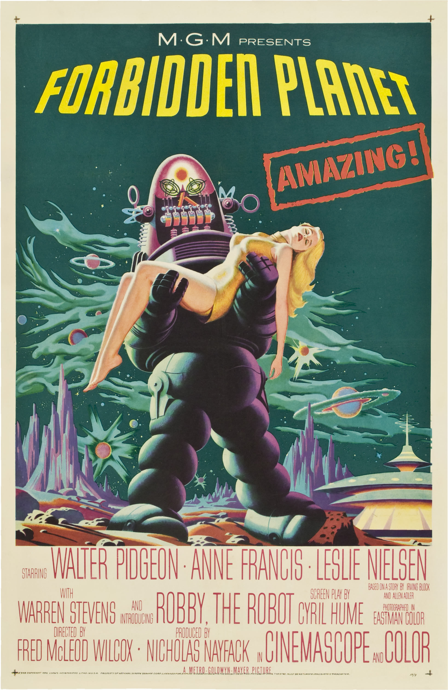

# [RoboCon 2020 Workshops](https://robocon.io/#workshops): TEST AUTOMATION FOR THE ENTERPRISE DATA WAREHOUSE OR TEACHING AN OLD DOG NEW TRICKS!

## Robby the Robot is ready for RoboCon2020

# Table of Contents
1. [Introduction](#1-introduction)
2. [Preparation](#2-preparation)\
   2.1 [Installation of Python and pip](#installation-of-python-and-pip)\
   2.2 [Installation of Robot Framework]\
   2.3 [Installation of Robot Framework Database Library]\
   2.4 [Clone GitHub repository for this workshop]
3. [Python Database API Specification v2.0](#3-python-database-api-specification-v20)\
   3.1 [PEP-249](#31-pep-249)\
   3.2 [A brief introduction to DB-API2](#32-a-brief-introduction-to-db-api2)
4. [Robot Framework Database Library (External)](#4-robot-framework-database-library-external)
5. [Robot Framework Testing with Teradata](#5-robot-framework-testing-with-teradata)
6. [Teradata Database Library (in-house development @ OP)](#6-teradata-database-library-in-house-development--op)
7. [Test Automation with Jenkins CI](#7-test-automation-with-jenkins-ci)
8. [IBM InfoSphere DataStage Library (in-house development @ OP)](#8-ibm-infosphere-datastage-library-in-house-development--op)
9. [The future - what are we working on next @ OP?](#9-the-future---what-are-we-working-on-next--op)

## 1. Introduction
The concept of data warehousing dates back to the late 1980s so you would be forgiven for thinking that test automation has little to offer this domain. OP needed to find a way of improving the quality of DW solutions: enter Robot Framework. You really can teach an old dog new tricks!

[Robot Framework](http://robotframework.org/) is a generic open source automation framework for acceptance testing, acceptance test driven development (ATDD), and robotic process automation (RPA). It has simple plain text syntax and it can be extended easily with libraries implemented using Python or Java. The [Robot Framework User Guide](http://robotframework.org/robotframework/latest/RobotFrameworkUserGuide.html) contains all you need to get started and it also covers more advanced topics such as development of your own test libraries.

Database Library contains utilities meant for Robot Framework's usage. This can allow you to query your database after an action has been made to verify the results.

## 2. Preparation
### 2.1 Installation of Python and pip
#### Python 2 vs Python 3
Which version?  Check the [wiki](https://wiki.python.org/moin/Python2orPython3) from python.org.
Quite simply, you should use Python 3 going forward.
Python 2 is End of Life and the final release will be April 2020 and after that date will receive no further official report.
#### Check which versions of Python and pip (The Python Package Installer) are installed:
`$ python3 --version`\
`$ pip3 --version`
#### If necessary, install pip (The Python Package Installer):
`$ sudo apt update`\
`$ sudo apt install python3-pip`

### 2.2 Installation of Robot Framework
Installation of Robot Framework is documented [here](https://github.com/robotframework/robotframework#installation).
There are two main methods: using pip or installing the latest version from source code.
#### Install using pip:
`$ pip install robotframework`
#### Install by git cloning the repository from GitHub and run setup.py:
`$ git clone https://github.com/robotframework/robotframework.git`

### 2.3 Installation of Robot Framework Database Library
#### Install using pip:
`$ pip install robotframework-database-library`
### 2.4 Clone GitHub repository for this workshop
#### Clone the GitHub repository which contains workshop documentation and examples:
`$ git clone https://github.com/adrianyorke/forbiddenplanet`

## 3. Python Database API Specification v2.0
### 3.1 PEP-249
[PEP 249 -- Python Database API Specification v2.0](https://www.python.org/dev/peps/pep-0249/)
### 3.2 A brief introduction to DB-API2
[A brief introduction to DB-API2](https://cewing.github.io/training.codefellows/lectures/day21/intro_to_dbapi2.html)

## 4. Robot Framework Database Library (External)
RF DB Lib
2
3
4
5
6

## 5. Robot Framework Testing with Teradata
Testing with Teradata
2
3
4
5
6

## 6. Teradata Database Library (in-house development @ OP)
Teradata Database Library
2
3
4
5
6

## 7. Test Automation with Jenkins CI
CI
2
3
4
5
6

## 8. IBM InfoSphere DataStage Library (in-house development @ OP)
DataStage
2
3
4
5
6

## 9. The future - what are we working on next @ OP?
Future
2
3
4
5
6
